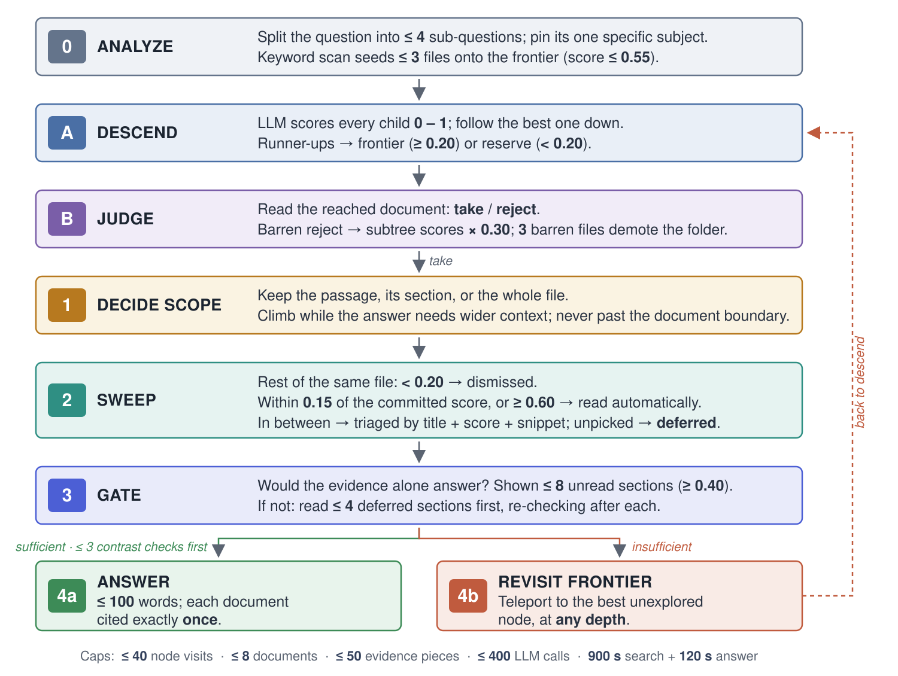

# TreeRAG: agentic hierarchical retrieval for genomics quality-management documents

<div align="center">

[](https://github.com/courtotlab/tree-rag/actions/workflows/ci.yml)
[](https://www.python.org/)
[](LICENSE)

</div>

**Recursive summarization and agentic tree traversal over large, structured corpora.**

TreeRAG lets an open-weight language model navigate a corpus-level hierarchy,
retain relevant evidence, recover from an early wrong turn, and answer with source
references. It is designed for document collections where structure, privacy,
and auditability matter.



- [Overview](#overview)
- [Getting started](#getting-started)
- [How TreeRAG retrieves evidence](#how-treerag-retrieves-evidence)
- [Reproducing the public evaluation](#reproducing-the-public-evaluation)
- [Advanced settings](#advanced-settings)
- [Evaluated implementation and vector boundary](#evaluated-implementation-and-vector-boundary)
- [Repository layout](#repository-layout)
- [Data, privacy, and licensing](#data-privacy-and-licensing)
- [Next steps](#next-steps)
- [Acknowledgements](#acknowledgements)
- [Citation](#citation)

---

## Overview

Clinical laboratories keep many controlled documents in nested folder
hierarchies, and staff need effective methods to find specific information
inside them. More generally, governed organizations face the same challenge
across large collections of policies, procedures, reports, and records.

Single-shot ranking does not explicitly consider document structure, so queries
whose answers are found in tables, span sections, or require multiple documents
can perform poorly. TreeRAG recursively summarizes the corpus into a
hierarchical tree. From there, an open-weight LLM agent traverses the tree to
find and retain the most relevant passages for a question.

### Key features

- **Corpus-level summarization tree:** preserves folder, document, section, and
  passage structure instead of flattening the collection into independent chunks.
- **Agentic tree traversal:** recursively scores visible branches and follows the
  strongest route toward relevant evidence.
- **Cross-document retention:** accumulates passages across traversal steps and
  documents before composing an answer.
- **Corpus-global recovery:** a teleport frontier resumes from the strongest
  unexplored node at any depth after an unproductive branch.
- **Evidence-aware reading:** scope selection, same-document sweeps, and an
  evidence-sufficiency gate determine whether to answer or continue searching.
- **Bounded and auditable execution:** explicit budgets limit model calls and
  visited nodes, while traces and source identifiers support inspection.
- **Open-weight deployment:** TreeRAG uses an Ollama-compatible endpoint and
  can run inside the same approved compute boundary as confidential data.
- **No dense-vector evidence retrieval:** evidence is reached through tree
  navigation rather than a dense retrieval index.

### What this release contains

- `src/treerag/`: the documented modular controller and command-line interface.
- `reference/evaluated_v0/`: immutable source snapshots for the evaluated method.
- `experiments/multihop_rag/`: the frozen public sample, runner, official
  evaluator adapter, aggregate outputs, and pinned upstream evaluator.
- `data/multihop_rag_demo/corpus_tree.json`: a committed public tree with 20,495
  nodes over 609 MultiHop-RAG articles.
- `tests/`: synthetic unit and controller tests that do not require corpus data.

## Getting started

### Package requirements

- Python 3.11 or 3.12
- OICR VPN and SSH access to the approved Ollama host
- Local port `11528` available for the SSH tunnel
- Approximately 30 MB of free space for the committed public tree

### Install

```bash
git clone git@github.com:courtotlab/tree-rag.git
cd tree-rag
uv sync
```

### Open the OICR Ollama tunnel

TreeRAG runs on the workstation. Model requests reach the approved OICR Ollama
service through an SSH local forward; no TreeRAG process or corpus is placed on
the server.

Keep this command running in a dedicated terminal while using TreeRAG:

```bash
ssh -NT \
  -o ExitOnForwardFailure=yes \
  -o ServerAliveInterval=60 \
  -o ServerAliveCountMax=3 \
  -o IdentitiesOnly=yes \
  -i "$HOME/.ssh/id_ed25519" \
  -L 127.0.0.1:11528:172.17.0.1:11434 \
  asharma@ollama.res.oicr.on.ca
```

The command is silent after connecting. In a second terminal, configure and verify
the tunneled endpoint:

```bash
export TREERAG_OLLAMA_URL=http://127.0.0.1:11528
export TREERAG_MODEL=gpt-oss:120b
curl -fsS "$TREERAG_OLLAMA_URL/api/version"
curl -fsS "$TREERAG_OLLAMA_URL/api/tags"
```

Do not run Ollama locally or bind the forward to a non-loopback address. See the
[private OICR tunnel runbook](docs/OICR_CLUSTER.md) for both demos.

### Build the MultiHop-RAG tree

The smoke test and a complete tree build use the same builder, models, and summarization
prompts. For a smoke test, stop after the progress bar begins moving. For a complete
build, leave the same command running until it finishes. Every invocation writes to a
new versioned cache and never overwrites the committed demonstration tree:

```bash
export TREERAG_OLLAMA_URL=http://127.0.0.1:11528
export TREERAG_MODEL=gpt-oss:120b
export TREERAG_BUILD_WORKERS=4
RUN_ROOT="$HOME/treerag-runs/build-smoke-$(date +%Y%m%d_%H%M%S)"
mkdir -p "$RUN_ROOT"
export TREERAG_CACHE_DIR="$RUN_ROOT/tree_cache"
uv run ./scripts/build_tree.sh
```

The script first materializes and parses 609 public documents. Wait until
`2/3 text [gpt-oss:120b]` reports completed calls and an ETA, then press `Ctrl-C`
once if this is only a smoke test. Pending work is cancelled and completed parse/node
caches are preserved. Do not interrupt the process when producing a complete tree.
MultiHop-RAG is text-only, so the frozen builder correctly reports
`gemma3:27b ... describe=False` and makes no vision calls.

The completed tree is written to `$TREERAG_CACHE_DIR/corpus_tree.json`. This workflow
was exercised on August 13, 2026 with Ollama 0.30.10; it planned 19,971 calls and
displayed a live ETA. Timing varies with shared-server load.

### Answer a single query

Querying the committed tree exercises one complete retrieval-and-answer cycle without
rebuilding the hierarchy. Keep the tunnel terminal open, then run in a second terminal:

```bash
export TREERAG_OLLAMA_URL=http://127.0.0.1:11528
export TREERAG_MODEL=gpt-oss:120b
export TREERAG_MODE=thorough
RUN_ROOT="$HOME/treerag-runs/query-$(date +%Y%m%d_%H%M%S)"
mkdir -p "$RUN_ROOT"
uv run ./scripts/query_single_question.sh \
  "Which developments are compared across multiple reports?" \
  | tee "$RUN_ROOT/query.json"
```

The JSON response contains the answer, source identifiers, elapsed time, model calls,
and operating mode. The thorough query used to validate this workflow completed with
26 model calls in 124.36 seconds.

### Generate benchmark responses

The benchmark launcher runs the frozen evaluated-v0 prompts and controller over the
reported balanced sample of 200 MultiHop-RAG questions. It uses the committed public
tree by default and writes every run to a new timestamped report:

```bash
export TREERAG_OLLAMA_URL=http://127.0.0.1:11528
export TREERAG_MODEL=gpt-oss:120b
uv run ./scripts/run_multihop_benchmark.sh
```

The launcher prints the report path before starting. To resume an interrupted run,
explicitly provide that same path; otherwise a new report is always created:

```bash
export TREERAG_BENCHMARK_REPORT="$HOME/treerag-runs/treerag_public_rerun.json"
uv run ./scripts/run_multihop_benchmark.sh
```

This reproduces the response-generation stage reported in the study. It does not claim
to run all 2,556 MultiHop-RAG questions. Run the official evaluator afterward as
described in [the experiment guide](experiments/multihop_rag/README.md).

## How TreeRAG retrieves evidence

1. **Build the summarization tree.** Each node describes its children while
   preserving the path from corpus to folder, document, section, and passage.
2. **Traverse and retain.** The model scores visible branches, descends into the
   strongest candidate, and retains relevant passages.
3. **Decide scope.** When evidence is reached, the controller can retain the
   passage, its section, or its document according to the question.
4. **Sweep locally.** Other high-scoring sections from the same document can be
   read while unrelated sections are skipped.
5. **Check sufficiency.** A gate asks whether the retained evidence answers the
   question completely.
6. **Answer or revisit the frontier.** If evidence is incomplete, TreeRAG jumps
   to the best unexplored node at any depth and continues within budget.

## Reproducing the public evaluation

The artifact includes the frozen question sample, exact benchmark runner,
official MultiHop-RAG evaluator adapter, aggregate outputs, and pinned upstream
evaluator:

```bash
cd experiments/multihop_rag
uv run python official_multihop_eval.py --help
```

The exact executed runner is preserved at
`reference/evaluated_v0/benchmark_treerag_public_frozen_v0.py`. The runnable
experiment copy changes only runtime path, model, and endpoint configuration.
Read [the experiment guide](experiments/multihop_rag/README.md) before launching
a full run. It is expensive, and each output must use a new versioned path.

See [RESULTS.md](RESULTS.md) for metrics, uncertainty, controls, and limitations.
See [REPRODUCIBILITY.md](REPRODUCIBILITY.md) for the artifact checklist.

## Advanced settings

### Search modes

- `thorough`: the primary research operating point, with a larger traversal
  budget and full evidence checks.
- `quick`: a lower-cost sensitivity setting with a smaller search budget.

### Runtime configuration

```bash
export TREERAG_OLLAMA_URL=http://127.0.0.1:11528
export TREERAG_MODEL=gpt-oss:120b
uv run treerag --help
```

Do not edit a frozen result file in place. Use a new output path for every run so
earlier experiments remain recoverable.

## Evaluated implementation and vector boundary

Reported experiments use **evaluated-v0**, preserved as an immutable source
snapshot. The modular package is a hardened release port with bounded retries,
queue hygiene, tree validation, and a lexical-only default for over-wide
candidate presentation. Results are never retrospectively relabeled across
these versions.

TreeRAG does not use a dense index to retrieve evidence: the LLM scores tree
branches, and evidence is reached through navigation. For scientific precision,
evaluated-v0 used local embeddings only to order names displayed inside an
over-wide `contains:` preview. The modular release defaults
`max_embed_per_decision=0` and uses lexical ordering. The evaluated method is
therefore described as **LLM-routed tree retrieval without dense-vector evidence
retrieval**, not as having no vector computation anywhere.

## Repository layout

```text
src/treerag/                 modular controller and CLI
scripts/                       query and tree-build launchers
data/multihop_rag_demo/        committed public demonstration tree
experiments/multihop_rag/      frozen sample, runners, evaluator, public outputs
reference/evaluated_v0/        immutable evaluated source snapshots
docs/                          architecture and remote-compute guidance
tests/                         synthetic unit and controller tests
```

## Data, privacy, and licensing

MultiHop-RAG is licensed under ODC-BY. TreeRAG source is GPL-3.0-or-later. See
[DATA_POLICY.md](DATA_POLICY.md) and [SECURITY.md](SECURITY.md).

Never commit private corpora, trees, questions, answers, traces, credentials,
endpoints, or result files. For confidential collections, run both TreeRAG and
the open-weight model inside the approved organizational compute boundary.

## Next steps

Next steps can consider running the remaining public controls and evaluating
other systems like Psi-RAG as a separate external baseline. They would broaden
public-benchmark coverage and help position TreeRAG against a recent
vector-assisted retrieval system.

## Acknowledgements

TreeRAG grew from the TreeRAG project in Genome Informatics at the Ontario
Institute for Cancer Research, with work by Arjun Sharma, Jochen Weile, Kayla
Marsh, and Melanie Courtot. The project was supported by the University of
Toronto Data Sciences Institute and the Government of Ontario.

## Citation

Citation metadata is provided in [CITATION.cff](CITATION.cff). The manuscript is
intentionally excluded from this repository before publication.
