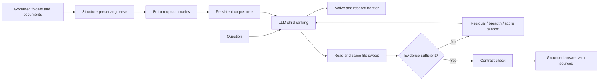

# Architecture

## Build phase

The builder preserves directory, document, and heading structure. Paragraphs, tables,
and figures become evidence-bearing leaves; summaries are created bottom-up and cached
per node. The tree is built once and amortized over future questions.

## Query phase

The controller scores a bounded candidate set with the language model, descends locally,
and retains runner-up branches globally. Reads can expand to an enclosing section and
sweep unread sections in the same document. A sufficiency gate names missing evidence;
teleports then target a contradiction, residual need, unvisited region, or best retained
alternative. Search ends under explicit visit, source, evidence, call, and cooperative
wall-clock budgets.

## Why a native hierarchy

A governed hierarchy is stable, human-auditable, and already maintained for operational
reasons. TreeQuest tests that regime rather than claiming every corpus has a useful native
tree. PageIndex File System is the closest disclosed collection-scale architecture; it
adds query-dependent virtual nodes and dynamic flattening for weak hierarchies. TreeQuest
instead studies a frozen native hierarchy with a released controller and paired empirical
evaluation.

## Vector-signal boundary

Evidence is not selected by nearest-neighbor lookup. In evaluated-v0, embeddings only
order names inside an over-wide preview before the LLM scores branches. Modular-v1 sets
that helper to zero and uses lexical ordering. Always report the version used.
